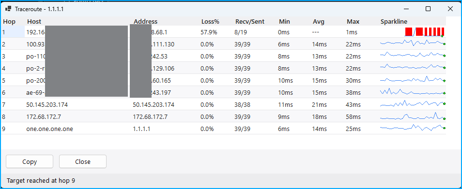

# PingoMeter

This is a fork of the original [Pingometer by EFLFE](https://github.com/EFLFE/PingoMeter), which is now archived, so I wanted to continue on this great tool!

PingoMeter - is a small program that show your ping in Windows system tray (in graph or numbers).

Double clicking the Icon or right-clicking the icon brings up an [WinMTR](https://winmtr.net/) style traceroute.

